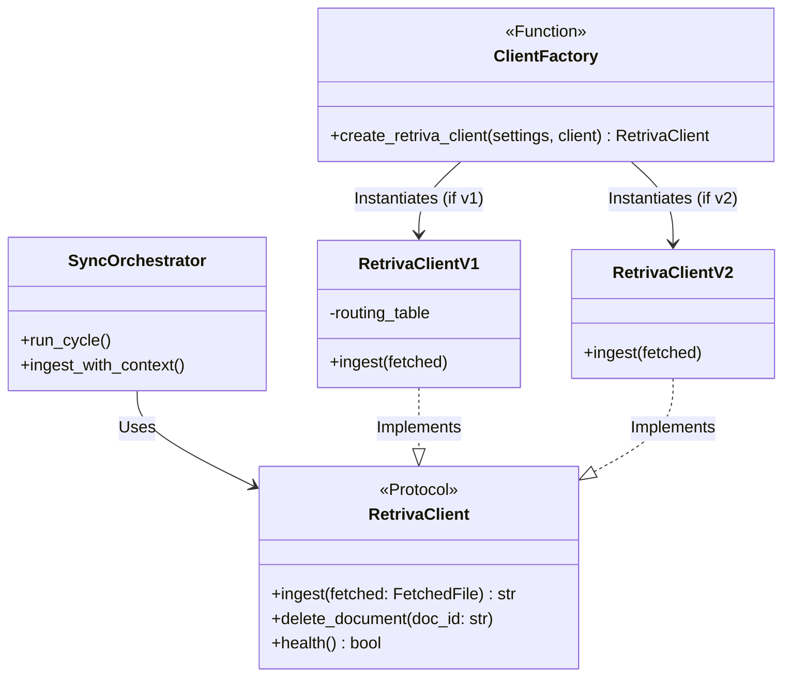

# Architecture Diagram & Plan
**Pattern**: Strategy Pattern for the Retriva Client.
**Initialization**: The app will instantiate either `RetrivaClientV1` or `RetrivaClientV2` on startup based on the environment variable.
**Metadata Handling**: The adapter will map Open WebUI file tags/metadata into the standard `user_metadata` dictionary expected by Core v2.

## Component Diagram

## Metadata Flow (v2)
1. Webhooks or sync polling retrieves `FetchedFile`.
2. Tags/Metadata are collected into `FetchedFile.user_metadata`.
3. `RetrivaClientV2.ingest` formats `user_metadata` into JSON.
4. HTTP POST multipart form data sent to Core's `/api/v2/documents` endpoint.
