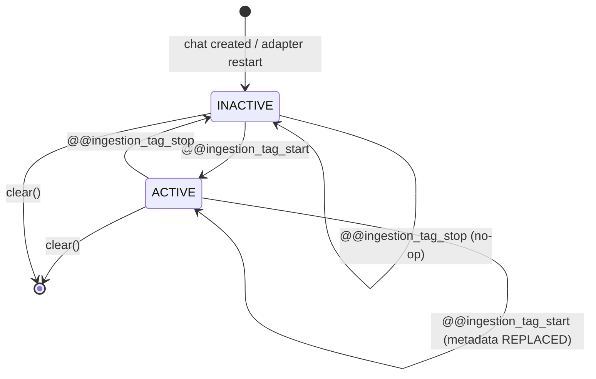

# Architecture — Ingestion Context State Machine & Directive Parsing

**Status:** Implemented  
**Version:** 1.0  
**Date:** 2026-04-23  

---

## 1. Overview

The Thin Adapter maintains a **per-chat ingestion context** that allows users
to attach structured metadata to documents during ingestion.  Metadata
intent is expressed through chat directives — the adapter is a translator,
not an interpreter.

Two subsystems cooperate:

| Subsystem | Module | Responsibility |
|---|---|---|
| Directive Parser | `directive_parser.py` | Extract commands from chat message text (pure function) |
| Ingestion Context | `ingestion_context.py` | Per-chat state machine: track active metadata and KB IDs |

The parser is **stateless**; the context is **stateful but ephemeral**.

---

## 2. Directive Parser

### 2.1 Recognised Directives

| Directive | Effect |
|---|---|
| `@@ingestion_tag_start` | Begin metadata block; subsequent `key: value` lines are collected |
| `@@ingestion_tag_stop` | End metadata application for this chat |

### 2.2 Grammar

```
message        = *line
line           = directive / kv-pair / text
directive      = ws "@@ingestion_tag_start" / ws "@@ingestion_tag_stop"
kv-pair        = key ":" value
key            = 1*VCHAR          ; at least one visible char before colon
value          = *VCHAR           ; may be empty
ws             = *SP              ; leading whitespace tolerated
```

### 2.3 Parsing Rules

```
┌─────────────────────────────────────────────────────────┐
│  Input: raw chat message string                         │
│                                                         │
│  1. Split into lines                                    │
│  2. Scan ALL lines for directives (case-insensitive)    │
│  3. If multiple directives → last one wins              │
│  4. If last directive = tag_stop → return tag_stop       │
│  5. If last directive = tag_start:                       │
│     a. Collect key:value from lines AFTER the directive │
│     b. Stop at first blank line or end-of-message       │
│     c. Skip lines without a valid "key:" prefix         │
│  6. If no directive found → return "none"               │
└─────────────────────────────────────────────────────────┘
```

### 2.4 Output Type

```python
@dataclass(frozen=True, slots=True)
class DirectiveResult:
    action: Literal["tag_start", "tag_stop", "none"]
    metadata: dict[str, str]  # populated only for tag_start
```

### 2.5 Examples

**tag_start with metadata:**
```
@@ingestion_tag_start
project: Apollo
milestone: M4
```
→ `DirectiveResult(action="tag_start", metadata={"project": "Apollo", "milestone": "M4"})`

**tag_stop:**
```
@@ingestion_tag_stop
```
→ `DirectiveResult(action="tag_stop", metadata={})`

**Regular message:**
```
What is the status of Project Apollo?
```
→ `DirectiveResult(action="none", metadata={})`

**Colon in value (URLs, timestamps):**
```
@@ingestion_tag_start
source: https://example.com:8080/docs
```
→ `metadata={"source": "https://example.com:8080/docs"}`

### 2.6 Design Decisions

| Decision | Rationale |
|---|---|
| Pure function, no state | Separation of concerns — parsing vs. context management |
| Case-insensitive directives | UX tolerance — `@@INGESTION_TAG_START` also works |
| Last-directive-wins | Deterministic behavior for malformed messages |
| Tolerant key:value parsing | Skip invalid lines rather than reject the whole message |
| Blank line terminates block | Natural boundary — prevents accidental metadata from body text |

---

## 3. Ingestion Context State Machine

### 3.1 States



| State | Metadata available | Effect on uploads |
|---|---|---|
| `INACTIVE` | No | Files ingested without `user_metadata` |
| `ACTIVE` | Yes | Files enriched with `user_metadata` dict |

### 3.2 Transition Table

| Current State | Input | Next State | Side Effect |
|---|---|---|---|
| `INACTIVE` | `tag_start{m}` | `ACTIVE` | Store metadata `m` |
| `ACTIVE` | `tag_start{m'}` | `ACTIVE` | **Replace** metadata with `m'` (not merge) |
| `ACTIVE` | `tag_stop` | `INACTIVE` | Clear metadata |
| `INACTIVE` | `tag_stop` | `INACTIVE` | No-op |
| Any | `none` | Unchanged | No-op |
| Any | `clear()` | Entry removed | Remove all state for chat |

### 3.3 Replacement Semantics (FR2)

```
tag_start {project: Alpha, phase: 1}
  → metadata = {project: Alpha, phase: 1}

tag_start {project: Beta}
  → metadata = {project: Beta}          ← "phase" is GONE
```

This is intentional: each `@@ingestion_tag_start` is a **full replacement**,
not a merge.  The user expresses their *complete* intent each time.

### 3.4 KB IDs — Independent Track

KB IDs (`kb_ids`) are tracked on a **separate axis** from the metadata
state machine:

```
┌────────────────────────────────┐
│        Per-Chat Context        │
│  ┌──────────┐  ┌────────────┐  │
│  │ Metadata │  │  KB IDs    │  │
│  │ state    │  │ (always    │  │
│  │ machine  │  │  tracked)  │  │
│  └──────────┘  └────────────┘  │
└────────────────────────────────┘
```

| Property | Metadata | KB IDs |
|---|---|---|
| Affected by `tag_start` | ✅ Replaced | ❌ Not affected |
| Affected by `tag_stop` | ✅ Cleared | ❌ Not affected |
| Set by | Directive body | Webhook `kb_ids` field |
| Fallback | None (empty dict) | `DEFAULT_KB_ID` env var |
| Included in payload | Only when ACTIVE | **Always** |

### 3.5 Per-Chat State Shape

```python
@dataclass(slots=True)
class _ChatContext:
    state: Literal["ACTIVE", "INACTIVE"] = "INACTIVE"
    user_metadata: dict[str, str] = {}
    kb_ids: list[str] = []
    last_updated: str = "..."  # ISO 8601 UTC
```

### 3.6 Concurrency Model

- State is held in `dict[str, _ChatContext]` keyed by `chat_id`
- Protected by a single `threading.Lock`
- Lock scope: individual dict operations (microsecond-level hold times)
- No async lock needed — dict lookups do not yield to the event loop

---

## 4. Data Flow

### 4.1 Webhook Message Processing

```
POST /api/v1/chat/message
  │
  │  payload = { chat_id, message, kb_ids, file_ids }
  │
  ├─► Step 1: Update KB IDs (always, if provided)
  │     IngestionContext.set_kb_ids(chat_id, kb_ids)
  │
  ├─► Step 2: Parse directive from message text
  │     directive = parse_directive(message)
  │
  ├─► Step 3: Apply directive to context
  │     IngestionContext.apply_directive(chat_id, directive)
  │
  ├─► Step 4: If file_ids present → contextual ingestion
  │     │
  │     ├─► Resolve payload: IngestionContext.get_ingestion_payload(chat_id)
  │     │     → { "kb_ids": [...], "user_metadata": {...} }
  │     │
  │     ├─► For each file_id:
  │     │     ├─► Download from OWUI
  │     │     ├─► Enrich FetchedFile with kb_ids + user_metadata
  │     │     ├─► Forward to RetrivaClient.ingest()
  │     │     └─► Store mapping in SQLite
  │     │
  │     └─► Return SyncResult
  │
  └─► Return response { chat_id, directive, tagging_active, ingestion? }
```

### 4.2 Metadata Serialization to Retriva

```python
# In RetrivaClient._forward_multipart():
data = {
    "source_path": doc_id,
    "page_title": fetched.filename,
}
if fetched.kb_ids:
    data["kb_ids"] = json.dumps(list(fetched.kb_ids))
if fetched.user_metadata:
    data["user_metadata"] = json.dumps(fetched.metadata_dict())
```

Both fields are JSON-serialized strings in the multipart form data,
following the Retriva ingestion API contract (SDD-014).

---

## 5. Lifecycle & Memory Management

### 5.1 Ephemeral by Design

| Property | Value |
|---|---|
| Storage | In-memory `dict` |
| Persistence | None — lost on restart |
| Scope | Per adapter process |
| Cleanup | `clear(chat_id)` or process restart |

**Rationale:** The ingestion context represents *temporary user intent*
during a chat session, not durable system state.  Persisting it would:

- Introduce stale-state bugs (metadata applied to unexpected uploads)
- Require migration logic for schema changes
- Add complexity with no user benefit (users re-express intent each session)

### 5.2 Memory Bounds

Each `_ChatContext` is ~200 bytes (metadata dict + kb_ids list + strings).
At 10,000 concurrent chats, total memory is ~2 MB — negligible.

No eviction policy is currently implemented.  Future enhancement: TTL-based
eviction for contexts inactive for >1 hour.

---

## 6. Debug Endpoint

```
GET /internal/ingestion-tagging/{chat_id}
```

**Gated** by `THIN_ADAPTER_DEBUG_ENDPOINTS=true` (default: disabled).

Response:

```json
{
  "chat_id": "chat_abc",
  "state": "ACTIVE",
  "user_metadata": {
    "project": "Apollo",
    "milestone": "M4"
  },
  "kb_ids": ["kb_r_and_d"],
  "last_updated": "2026-04-23T10:15:42Z"
}
```

When no context exists for the chat:

```json
{
  "chat_id": "chat_abc",
  "state": "INACTIVE",
  "user_metadata": {},
  "kb_ids": [],
  "last_updated": null
}
```

---

## 7. Observability

| Metric | Type | Labels | Description |
|---|---|---|---|
| `adapter_webhook_messages_total` | Counter | — | Total chat messages received |
| `adapter_directives_processed_total` | Counter | `action` | Directives parsed (tag_start, tag_stop) |
| `adapter_files_synced_total` | Counter | — | Files successfully ingested (both paths) |

Structured log events:

| Event | Level | Fields |
|---|---|---|
| `ingestion_context_activated` | INFO | `chat_id`, `metadata_keys` |
| `ingestion_context_deactivated` | INFO | `chat_id` |
| `ingestion_context_cleared` | INFO | `chat_id` |
| `contextual_ingest_succeeded` | INFO | `file_id`, `doc_id`, `kb_ids`, `metadata_keys` |
| `contextual_ingest_failed` | ERROR | `file_id`, `error` |

---

## 8. Module Dependency Graph

```
main.py
  ├── directive_parser.py      (pure function, no dependencies)
  ├── ingestion_context.py     (depends on: directive_parser)
  ├── orchestrator.py          (depends on: ingestion_context, fetcher, retriva_client, mapping_store)
  └── retriva_client.py        (depends on: models, config)

  directive_parser ──► ingestion_context ──► orchestrator ──► retriva_client
       (parse)            (state)            (coordinate)      (forward)
```

No circular dependencies.  `directive_parser` is a leaf module with
zero imports from the adapter package.
