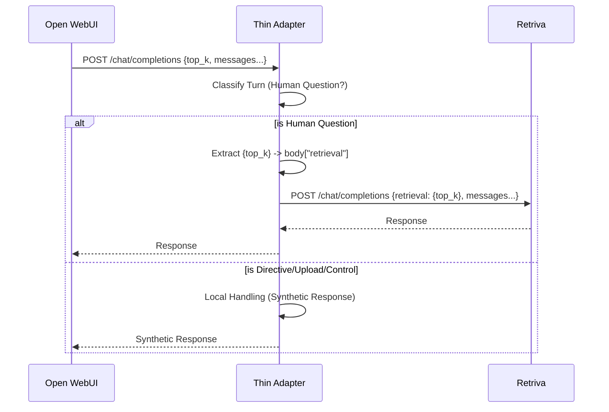

# Architecture — Retrieval Configuration via OWUI Control Panel

## Design Principle
The Thin Adapter acts as a semantic bridge, mapping generic LLM parameters from the OWUI frontend to specific RAG retrieval controls in the Retriva backend.

## Data Flow

1.  **Open WebUI** emits a `POST /v1/chat/completions` request.
    -   Parameters: `top_k`, `top_p`, `temperature` are at the top level.
2.  **Thin Adapter** intercepts the request.
    -   **Classification**: Uses `TurnClassifier` to determine if the turn is a `forward` route (substantive human question).
    -   **Transformation**:
        -   If `route == "forward"`:
            -   Extracts `top_k`, `top_p`, `temperature`.
            -   Constructs `body["retrieval"] = { ... }`.
            -   Logs the transformation for observability.
3.  **Retriva Backend** receives the modified body.
    -   Applies the `retrieval` object parameters to the vector search and reranking process.

## Component Mapping

| Component | Role | Logic |
| :--- | :--- | :--- |
| `main.py` | Controller | Orchestrates extraction and body mutation. |
| `turn_classifier.py` | Filter | Ensures parameters are only forwarded for human questions (excluding control prompts). |
| `Retriva API` | Sink | Consumes the `retrieval` overrides. |

## Parameter Reinterpretation Table

| OWUI Parameter | Semantic Meaning in RAG |
| :--- | :--- |
| `top_k` | Number of documents to retrieve (limit). |
| `top_p` | Retrieval diversity / threshold tuning. |
| `temperature` | Re-ranking "sharpness" or diversity. |

## Sequence Diagram

